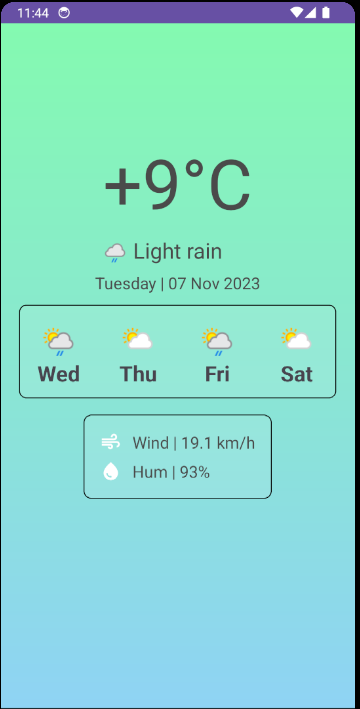

# Weather App
Для создания приложения использовался https://www.weatherapi.com/.
Реализованы следующие экраны: 
* Главный экран с информацией о погоде.
* Экран с ошибкой.
Для навигации между экранами используется библиотека Cicerone.

## Главный экран

Отображение прогноза погоды на следующие дни реализовано с помощью RecyclerView.

## Экран с ошибкой

При нажатии на кнопку retry происходит переход на главный экран.
